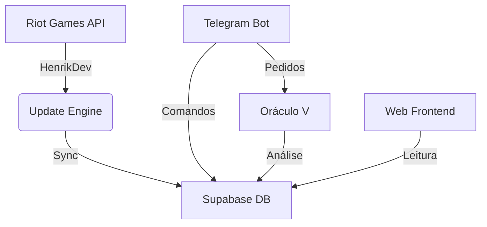

# Protocolo V: Hub de Inteligência Tática 🛡️

O **Protocolo V** é um ecossistema completo para gestão de line-ups de Valorant, análise de performance via IA (Oráculo V) e automação de operações de recrutamento.

---

## 🚀 Tecnologias Utilizadas

- **Backend:** Node.js, Express
- **Frontend:** HTML5, CSS3, Vanilla JavaScript
- **Banco de Dados:** Supabase (PostgreSQL)
- **Integrações:** Telegram Bot API, HenrikDev API (Unofficial Riot Games API)
- **Automação:** GitHub Actions (CI/CD)
- **Testes:** Jest

---

## 🛠️ Como Rodar Localmente

Siga os passos abaixo para preparar seu ambiente de comando:

1. **Clone o repositório:**
   ```bash
   git clone https://github.com/usuario/protocolov.git
   cd protocolov
   ```

2. **Instale as dependências:**
   ```bash
   npm install
   ```

3. **Configure as variáveis de ambiente:**
   - Crie um arquivo `.env` baseado no `.env.example`.
   - Preencha com suas chaves do Supabase, Telegram e HenrikDev API.

4. **Inicie o Bot e o Servidor:**
   ```bash
   npm start
   ```

5. **Acesse o Site:**
   - Abra o arquivo `index.html` em seu navegador ou use uma extensão de Live Server.

---

## 📜 Scripts do package.json

- `npm start`: Inicia o bot do Telegram (`telegram-bot.js`) e o servidor Express.
- `npm test`: Executa a suíte de testes unitários e de integração utilizando Jest.
- `node update-data.js`: Manualmente engatilha a sincronização de dados da API.
- `node check_db.js`: Script utilitário para diagnóstico de saúde do banco de dados.

---

## 📐 Arquitetura Básica



Para uma visão detalhada, consulte o arquivo [PROJECT_CONTEXT.md](./PROJECT_CONTEXT.md).

---

## 🤝 Contribuição

Interessado em fortalecer o protocolo? Veja nossas diretrizes em [CONTRIBUTING.md](./CONTRIBUTING.md).

---
_Protocolo V // Sistemas de Defesa Avançada_
