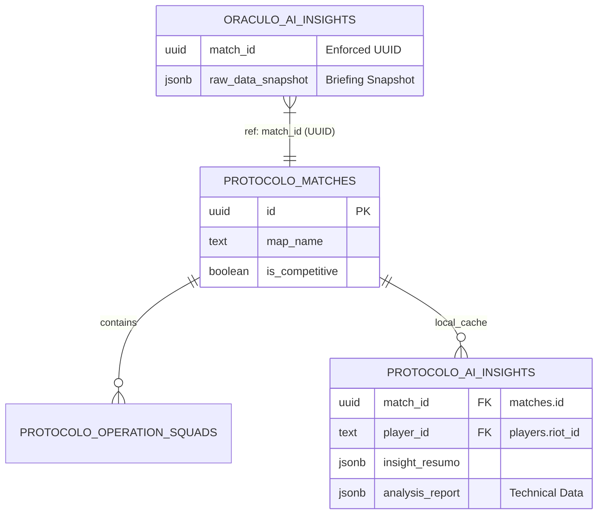

# Blueprint de Arquitetura & Plano de QA — Oráculo-V / Protocolo-V

Este documento define os padrões técnicos e estratégias de testes para garantir a integridade da ponte de inteligência tática entre o **Protocolo-V** (Gestão de Operações) e o **Oráculo-V** (Motor de Análise).

---

## 1. Mapa de Dados Integrado

A integração utiliza uma arquitetura **Push-Sync**, onde o Protocolo-V é a fonte da verdade para eventos de partida e o Oráculo-V é o motor de processamento "stateless" (guardando apenas snapshots para re-treino).

### Relacionamento de Entidades (ERD-Base)



- **Golden Record**: O `id` (UUID) da tabela `matches` no Protocolo-V é a âncora universal. Todas as requisições para o `/api/analyze` devem obrigatoriamente carregar este UUID.
- **Data Locality**: O Protocolo-V armazena uma cópia do relatório técnico (`analysis_report`) para permitir renderização instantânea no dashboard sem depender da disponibilidade do Oráculo.

---

## 2. Dicionário de Atributos Críticos

Os atributos abaixo são fundamentais para o cálculo de consistência e geração de coaching pela IA.

### Atributos de Partida (Ingestion)
| Atributo | Tipo | Descrição | Impacto na IA |
| :--- | :--- | :--- | :--- |
| `kills` / `deaths` | Integer | Volume de abates e quedas. | Cálculo de KD e agressividade. |
| `adr` | Float | Average Damage per Round. | Principal métrica de impacto em combate. |
| `kast` | Percentage | Kill, Assist, Survival, Traded. | Mede a utilidade do agente para o time. |
| `map_name`| String | Nome oficial do mapa. | Contexto tático (ex: post-plant em Haven). |

### Atributos de Perfil (Dashboard)
| Atributo | Tipo | Descrição | Uso no QA |
| :--- | :--- | :--- | :--- |
| `synergy_score`| Integer | Pontuação de entrosamento da squad. | Validar correlação com vitórias. |
| `performance_l`| Float | Nível de Performance (Holt Level). | Identificar anomalias de "underperformance". |
| `performance_t`| Float | Tendência de Performance (Holt Trend). | Previsão de "Burnout" ou "Peak". |

---

## 3. Plano de Testes (Best Practices)

### A. Testes Unitários (Oráculo-V)
- **Foco**: Funções de mapeamento em `worker.js` e montagem de templates em `prompt_engineer.js`.
- **Cenário Crítico**: Validar se o motor ignora `deaths` em rounds de vitória sem troca (Survival check).
- **Ferramenta**: Jest ou Mocha.

### B. Testes de Integração (The Bridge)
- **Fluxo**: `Protocolo:update-data.js` -> `OraculoService` -> `Oráculo:POST /api/analyze`.
- **Verificação**: O status `200 OK` deve retornar um JSON com campos `insight.resumo` (obrigatório) e `technical_data` (obrigatório).
- **Contrato**: Validar schema JSON usando `ajv` ou `Supertest`.

### C. Testes de Carga & Stress (LLM local)
- **Desafio**: O Ollama (local) é sequencial por natureza na GPU.
- **Estratégia**: Simular 5 requisições simultâneas de análise de squad completa.
- **Goal**: O timeout do `OraculoService` (45s) não deve ser atingido em squads de até 5 membros.
- **Throttling**: Validar se o `p-limit` ou similares no Oráculo gerenciam a fila corretamente sem derrubar o serviço.

### D. Mock Strategy (Offline Development)
Para permitir que o desenvolvimento do Frontend (Protocolo) continue mesmo com o Oráculo/Ollama desligado:

1.  **Mock de API (Nivo/Nock)**:
    Interceptar chamadas para `ORACULO_API_URL` e retornar um objeto estático:
    ```json
    {
      "status": "success",
      "insight": { "resumo": "Mock: Desempenho excelente no site A.", "model_used": "mock-engine" },
      "technical_data": { "rounds": [], "summary": { "kd": 1.5 } }
    }
    ```
2.  **Ollama Mock Web**: Usar uma imagem Docker do `ollama-mock` que apenas ecoa o prompt ou retorna uma resposta JSON genérica em < 100ms.

---

## 4. Cenários de Erro & Resiliência

| Evento | Comportamento Esperado | Ação de Recuperação |
| :--- | :--- | :--- |
| **Timeout (45s+)** | Log de erro no Coordenador. | O registro fica sem insight local. Corrigido pelo próximo ciclo de "Retry" automático do `update-data.js`. |
| **JSON Malformado** | Oráculo retorna `400 Bad Request`. | Logar o `raw_data_snapshot` no Oráculo para depuração do `prompter`. |
| **API Off** | `FetchError: Connection Refused`. | O `OraculoService` captura o erro e loga: `[❌] Oráculo inativo`. Sem impacto nos dados core de partidas. |
| **PlayerID Inválido** | Erro de Foreign Key no upsert local. | Sanitizar `player_tag` (lower-case transform) antes do envio. |

---

> [!TIP]
> **Prioridade de QA**: O teste mais crítico é a validação do `match_id`. Sem o UUID correto, os insights ficam órfãos e nunca serão exibidos no Dashboard, causando sensação de perda de dados para o usuário.

> [!IMPORTANT]
> **Segurança**: O `ADMIN_API_KEY` deve ser rotacionado trimestralmente e nunca deve ser exposto no Javascript do cliente (Browser). Todas as requisições autenticadas devem partir do servidor (Backend-to-Backend).
