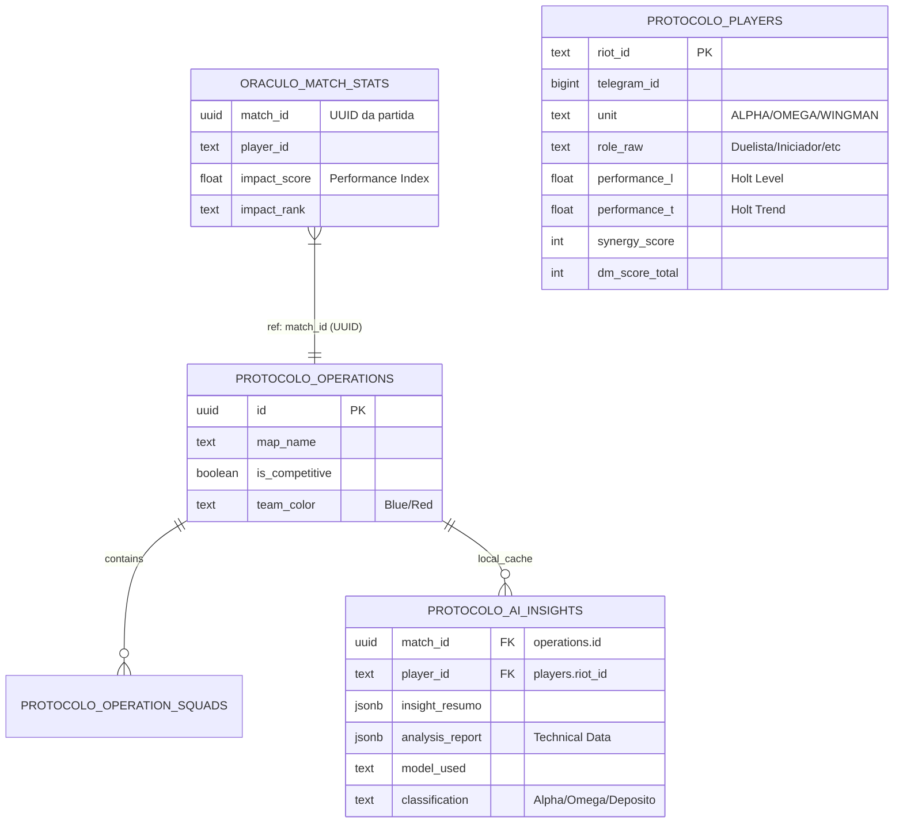

# Blueprint de Arquitetura & Plano de QA — Oraculo-V / Protocolo-V

Este documento define os padroes tecnicos e estrategias de testes para garantir a integridade da ponte de inteligencia tatica entre o **Protocolo-V** (Gestao de Operacoes) e o **Oraculo-V** (Motor de Analise).

---

## 1. Mapa de Dados Integrado

A integracao utiliza uma arquitetura **Push-Sync**, onde o Protocolo-V e a fonte da verdade para eventos de partida e o Oraculo-V e o motor de processamento.

### Relacionamento de Entidades (ERD-Base)

- **Golden Record**: O `id` (UUID) da tabela `operations` no Protocolo-V e a ancora universal.
- **Data Locality**: O Protocolo-V armazena uma copia do relatorio tecnico (`analysis_report`) para renderizacao sem depender do Oraculo.

---

## 2. Dicionario de Atributos Criticos

### Atributos de Partida (Ingestao)
| Atributo | Tipo | Descricao | Impacto na IA |
| :--- | :--- | :--- | :--- |
| `kills` / `deaths` | Integer | Volume de abates e quedas | Calculo de KD e agressividade |
| `adr` | Float | Average Damage per Round | Principal metrica de impacto |
| `kast` | Percentage | Kill, Assist, Survival, Traded | Utilidade do agente |
| `map_name`| String | Nome oficial do mapa | Contexto tatico |
| `hs_percent` | Float | Headshot percentage | Precisao mecanica |
| `agent_img` | String | URL da imagem do agente | Renderizacao visual |

### Atributos de Perfil (Dashboard)
| Atributo | Tipo | Descricao | Uso no QA |
| :--- | :--- | :--- | :--- |
| `synergy_score`| Integer | Pontuacao de entrosamento | Validar correlacao com vitorias |
| `performance_l`| Float | Nivel de Performance (Holt Level) | Identificar anomalias |
| `performance_t`| Float | Tendencia de Performance (Holt Trend) | Previsao de Burnout/Peak |
| `dm_score_total`| Integer | Pontos de Deathmatch | Ranking alternativo |
| `last_scan_at`| Timestamp | Ultimo scan do jogador | Detectar dados obsoletos |

### Sinergia (Algoritmo — `services/synergy-engine.js`)
| Squad Size | Pontos Base | Com Vitoria |
|---|---|---|
| 2 jogadores | 1 | 2 |
| 3 jogadores | 2 | 4 |
| 4+ jogadores | 5 | 10 |

---

## 3. Plano de Testes

### A. Testes Unitarios (Oraculo-V)
- **Foco**: Funcoes de mapeamento em `worker.js` e motor JS em `lib/analyze_valorant.js`.
- **Cenario Critico**: Validar calculo de Performance Index por role com pesos v4.2.
- **Ferramenta**: Jest.

### B. Testes de Integracao (The Bridge)
- **Fluxo**: `Protocolo:update-data.js` -> `OraculoService` -> `Oraculo:POST /api/queue`.
- **Verificacao**: HTTP 202 com campos `matchId` e `player`.
- **Callback**: Validar que `/api/insights/callback` persiste dados e notifica usuario.
- **Ferramenta**: Jest + Supertest.

### C. Testes de Carga (LLM)
- **Desafio**: O Tribunal Engine processa 3 chamadas LLM sequenciais por analise.
- **Estrategia**: Simular 5 requisicoes simultaneas de analise.
- **Goal**: Timeout de 5 minutos por job nao deve ser atingido.

### D. Status Atual de Testes
> **Nota de transparencia**: A infraestrutura de mocks (Nivo/Nock) mencionada anteriormente NAO esta implementada. Os testes atuais sao basicos e nao cobrem todos os cenarios descritos acima. A implementacao de uma suite completa de testes e um item pendente.

---

## 4. Cenarios de Erro & Resiliencia

| Evento | Comportamento Esperado | Acao de Recuperacao |
| :--- | :--- | :--- |
| **Timeout (5min)** | Job marcado como `failed` com erro `TIMEOUT_LIMIT_REACHED` | Pode ser retentado manualmente |
| **Webhook Falhou** | Oraculo tenta persistencia direta no banco do Protocolo | Fallback via `PROTOCOL_SUPABASE_URL` |
| **LLM Indisponivel** | Tribunal falha, cai para OpenRouter, depois Ollama | Fallback final: insight baseado apenas nos dados JS |
| **HenrikDev 429** | Rate limit com backoff baseado em `settings.json` | `base_delay_ms` + jitter aleatorio |
| **JSON Malformado** | Oraculo retorna `400 Bad Request` | Log do payload para depuracao |
| **API Off** | `FetchError: Connection Refused` | Protocolo loga erro, dados core de partidas nao sao afetados |

---

> **Prioridade de QA**: O teste mais critico e a validacao do `match_id` (UUID). Sem o UUID correto, os insights ficam orfaos e nunca serao exibidos.

> **Seguranca**: O `ADMIN_API_KEY` deve ser rotacionado trimestralmente e nunca exposto no JavaScript do cliente.
