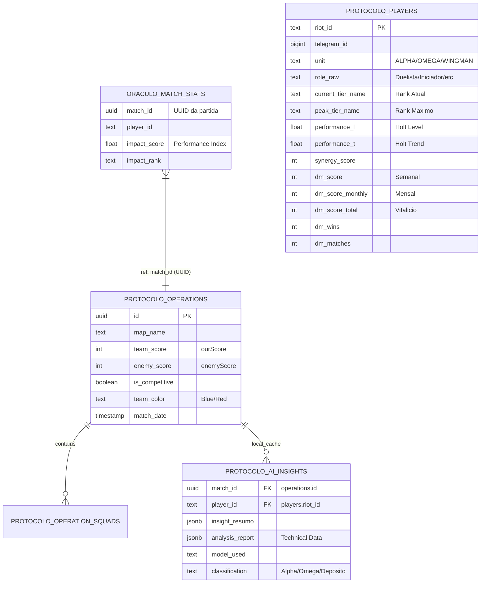

# Blueprint de Arquitetura & Plano de QA — Oraculo-V / Protocolo-V

Este documento define os padroes tecnicos e estrategias de testes para garantir a integridade da telemetria tatica entre o **Protocolo-V** (Gestao de Operacoes e Portal Web) e o **Oraculo-V** (Motor de Analise e IA).

---

## 1. Mapa de Dados Integrado

A integracao utiliza uma arquitetura **Push-Sync**, onde o Protocolo-V e a fonte da verdade para eventos de partida e o Oraculo-V e o motor de processamento.

### Relacionamento de Entidades (ERD-Base)

```mermaid
erDiagram
    PROTOCOLO_OPERATIONS ||--o{ PROTOCOLO_OPERATION_SQUADS : contains
    PROTOCOLO_OPERATIONS ||--o{ PROTOCOLO_AI_INSIGHTS : "local_cache"
    ORACULO_MATCH_STATS }|--|| PROTOCOLO_OPERATIONS : "ref: match_id (UUID)"

    PROTOCOLO_PLAYERS {
        text riot_id PK
        bigint telegram_id
        text unit "ALPHA/OMEGA/WINGMAN"
        text role_raw "Duelista/Iniciador/etc"
        text current_tier_name "Rank Atual"
        text peak_tier_name "Rank Maximo"
        float performance_l "Holt Level"
        float performance_t "Holt Trend"
        int synergy_score
        int dm_score "Semanal"
        int dm_score_monthly "Mensal"
        int dm_score_total "Vitalicio"
        int dm_wins
        int dm_matches
    }

    PROTOCOLO_OPERATIONS {
        uuid id PK
        text map_name
        int team_score "ourScore"
        int enemy_score "enemyScore"
        boolean is_competitive
        text team_color "Blue/Red"
        timestamp match_date
    }

    PROTOCOLO_AI_INSIGHTS {
        uuid match_id FK "operations.id"
        text player_id FK "players.riot_id"
        jsonb insight_resumo
        jsonb analysis_report "Technical Data"
        text model_used
        text classification "Alpha/Omega/Deposito"
    }

    ORACULO_MATCH_STATS {
        uuid match_id "UUID da partida"
        text player_id
        float impact_score "Performance Index"
        text impact_rank
    }
```

- **Golden Record**: O `id` (UUID da Riot) da tabela `operations` no Protocolo-V e a ancora universal.
- **Regra de Ouro da Pontuacao**: O placar de `operations` DEVE ser sempre registrado como `team_score` sendo os rounds do esquadrao do cla e `enemy_score` os rounds adversarios (`ourScore - enemyScore`), independente se o cla estava no time Blue ou Red na API da Riot.

---

## 2. Dicionario de Atributos Criticos

### Atributos de Partida (Ingestao)
| Atributo | Tipo | Descricao | Impacto no Sistema |
| :--- | :--- | :--- | :--- |
| `team_score` / `enemy_score` | Integer | Rounds do cla vs inimigo (`ourScore - enemyScore`) | Determinacao de vitoria e orientacao de placar |
| `kills` / `deaths` | Integer | Volume de abates e quedas | Calculo de KD e agressividade |
| `adr` | Float | Average Damage per Round | Principal metrica de impacto de dano |
| `kast` | Percentage | Kill, Assist, Survival, Traded | Participacao e utilidade do agente |
| `map_name` | String | Nome oficial do mapa | Contextualizacao tatica |
| `hs_percent` | Float | Headshot percentage | Precisao mecanica |
| `agent_img` | String | URL da imagem do agente | Renderizacao visual nos cards |

### Atributos de Perfil (Dashboard & Leaderboards)
| Atributo | Tipo | Descricao | Uso no QA / Regra |
| :--- | :--- | :--- | :--- |
| `synergy_score` | Integer | Pontuacao de entrosamento | Incrementado exclusivamente em partidas coletivas (squads) |
| `dm_score` | Integer | Pontos de Mata-Mata da semana | Zerado toda segunda-feira as 00:00 UTC por `reset-dm.js` |
| `dm_score_monthly` | Integer | Pontos de Mata-Mata do mes | Zerado todo dia 1º do mes as 00:00 UTC por `reset-dm.js` |
| `dm_score_total` | Integer | Pontos acumulados vitalicios | Historico permanente, nunca zerado |
| `dm_wins` / `dm_matches` | Integer | Vitorias e volume de treinos | Calculo de Winrate em Mata-Mata no `treino.html` |
| `performance_l` | Float | Nivel de Performance (Holt Level) | Deteccao de anomalias estatisticas |
| `performance_t` | Float | Tendencia (Holt Trend) | Previsao de curva de rendimento |
| `last_scan_at` | Timestamp | Ultimo scan do jogador | Monitoramento de telemetria obsoleta |

### Sinergia (Algoritmo — `services/synergy-engine.js`)
| Squad Size | Pontos Base | Com Vitoria |
|---|---|---|
| 2 jogadores | 1 | 2 |
| 3 jogadores | 2 | 4 |
| 4+ jogadores | 5 | 10 |

---

## 3. Plano de Testes & QA

### A. Testes Unitarios e Integridade de Dados
- **Orientacao de Placar**: Validar que partidas onde o cla jogou como Red Team e venceu (ex: Red 13 x 11 Blue) sao salvas como `team_score: 13, enemy_score: 11`.
- **Exclusao de Partidas Solo**: Operacoes cadastradas no feed "Ultimas Operacoes" DEVEM possuir pelo menos 2 membros do cla (`squad.length >= 2`). Partidas solo sao descartadas do feed de esquadrao.
- **Roteamento Multi-Regiao**: Validar que agentes com regioes `na`, `latam` ou `br` recebem os dados sem falhas de 404.

### B. Testes de Ciclo de Vida do Treino (Mata-Mata)
- **Script de Reset**: Execucao de `node src/cron/reset-dm.js` deve zerar `dm_score` nas segundas e `dm_score_monthly` nos dias 1º, preservando intacto o `dm_score_total`.
- **Calculo de Winrate**: O portal `treino.html` deve renderizar `% de Vitorias` valida sem retornar `NaN` ou `undefined` quando `matches === 0`.

### C. Testes da Ponte Oraculo-V
- **Despacho Assincrono**: `POST /api/queue` deve retornar HTTP 202 em menos de 3000ms.
- **Webhook Callback**: Validar que `/api/insights/callback` persiste os relatorios em `ai_insights` e notifica o Telegram.

---

## 4. Cenarios de Erro & Resiliencia

| Evento | Comportamento Esperado | Acao de Recuperacao |
| :--- | :--- | :--- |
| **HenrikDev 429** | Rate limit com backoff adaptativo em `api-client.js` | Exponential backoff com jitter aleatorio |
| **Agente Fantasma (404)** | Marcado como `is_ghost: true` | Pula requisicoes seguintes para evitar esgotamento de quota |
| **Webhook Falhou** | Oraculo tenta persistencia de emergencia direta no banco | Fallback via `PROTOCOL_SUPABASE_URL` |
| **Timeout de Fila (5min)** | Job marcado como `failed` em `match_analysis_queue` | Retentativa automatica no proximo ciclo de sync |
| **Dormencia GitHub Actions (60d)** | Workflows pausados pelo GitHub por inatividade | Reativacao via UI da aba Actions ou commit manual |

---
*Blueprint atualizado e revisado para alinhamento com a versao de producao do Protocolo-V (03/09/2026).*

